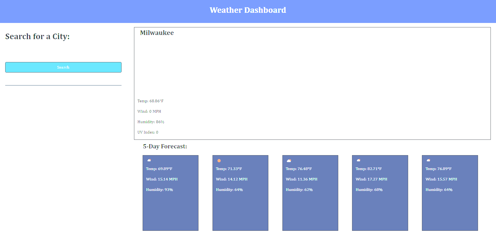

# weather-dashboard

##Intent

Weather Dashboard is an app designed to give a user the weather for the current day and weather for the next
five days! When they search a city, their response will be saved and converted to a button in the recently searched area for a more efficient search for next time.

# Built With

* HTML

* CSS

* JS

# Credits

Jeff Pigg (friend)

Aaron Merrifield (Software engineer at Infostretch)

# App Example

# Link to website

https://gestan24.github.io/weather-dashboard/